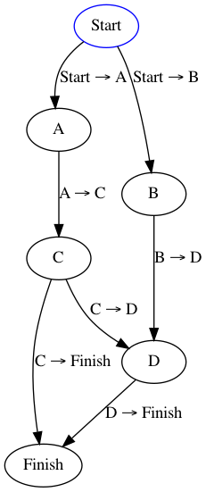

# Workflow for Go

Simple state machine. Inspired by [Symfony Workflow](https://github.com/symfony/workflow).

## Example usage

```go
o := new(ObjectImplementedPlaceer)

w := NewWorkflow("initial")
w.AddTransition("From initial to A", []Place{"initial"}, "A")
w.AddTransition("From initial to B", []Place{"initial"}, "B")
w.AddTransition("From A to C", []Place{"A"}, "C")
w.AddTransition("From B,C to D", []Place{"B", "C"}, "D")
w.AddTransition("From C,D to Finish", []Place{"C", "D"}, "Finish")

w.Can(o, "From initial to A") // == nil
w.Can(o, "From A to C") // == ErrCantApply

w.GetEnabledTransitions(o) // []string{"From initial to A", "From initial to B"}
w.Apply(o, "From inital to A") // o now at "A" place
w.GetEnabledTransitions(o) // []string{"From A to C"}

w.DumpToDot() // See above
```

## Dump result

```
digraph {
        initial[color="blue"];
        initial -> A[label="From initial to A"];
        initial -> B[label="From initial to B"];
        A -> C[label="From A to C"];
        B -> D[label="From B,C to D"];
        C -> D[label="From B,C to D"];
        C -> Finish[label="From C,D to Finish"];
        D -> Finish[label="From C,D to Finish"];
}
```

Visualization:



